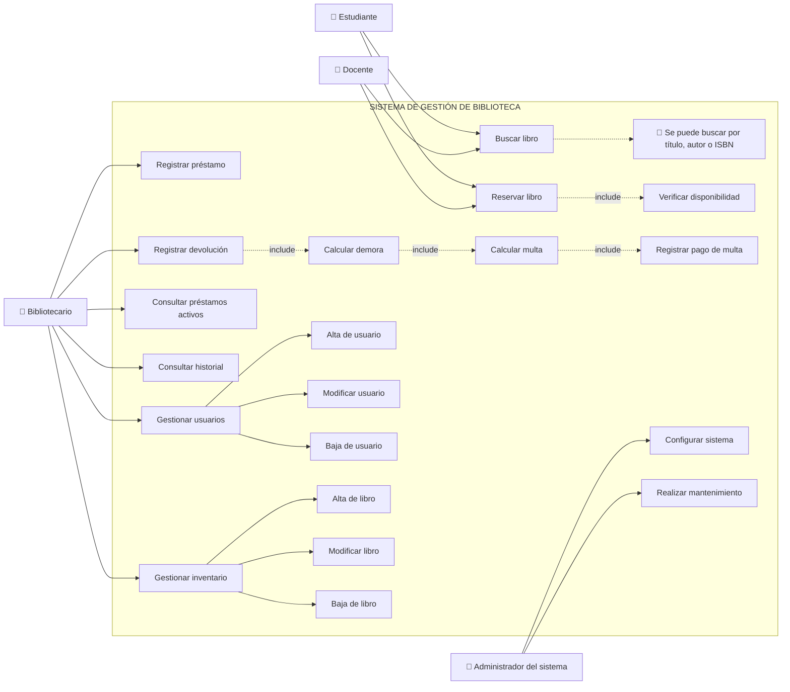

```mermaid

flowchart LR
    Estudiante["👤 Estudiante"]
    Docente["👤 Docente"]
    Bibliotecario["👤 Bibliotecario"]
    Administrador["👤 Administrador del sistema"]

    subgraph Sistema["SISTEMA DE GESTIÓN DE BIBLIOTECA"]

        Buscar["Buscar libro"]
        NotaBuscar["📝 Se puede buscar por título, autor o ISBN"]

        Reservar["Reservar libro"]
        Disponibilidad["Verificar disponibilidad"]

        Prestamo["Registrar préstamo"]
        Devolucion["Registrar devolución"]
        CalcularDemora["Calcular demora"]
        CalcularMulta["Calcular multa"]
        RegistrarPago["Registrar pago de multa"]

        Activos["Consultar préstamos activos"]
        Historial["Consultar historial"]

        Usuarios["Gestionar usuarios"]
        AltaUsuario["Alta de usuario"]
        ModUsuario["Modificar usuario"]
        BajaUsuario["Baja de usuario"]

        Inventario["Gestionar inventario"]
        AltaLibro["Alta de libro"]
        ModLibro["Modificar libro"]
        BajaLibro["Baja de libro"]

        Config["Configurar sistema"]
        Mantenimiento["Realizar mantenimiento"]
    end

    Estudiante --> Buscar
    Estudiante --> Reservar

    Docente --> Buscar
    Docente --> Reservar

    Bibliotecario --> Prestamo
    Bibliotecario --> Devolucion
    Bibliotecario --> Activos
    Bibliotecario --> Historial
    Bibliotecario --> Usuarios
    Bibliotecario --> Inventario

    Administrador --> Config
    Administrador --> Mantenimiento

    Buscar -.-> NotaBuscar

    Reservar -. "include" .-> Disponibilidad

    Devolucion -. "include" .-> CalcularDemora
    CalcularDemora -. "include" .-> CalcularMulta
    CalcularMulta -. "include" .-> RegistrarPago

    Usuarios --> AltaUsuario
    Usuarios --> ModUsuario
    Usuarios --> BajaUsuario

    Inventario --> AltaLibro
    Inventario --> ModLibro
    Inventario --> BajaLibro
```
