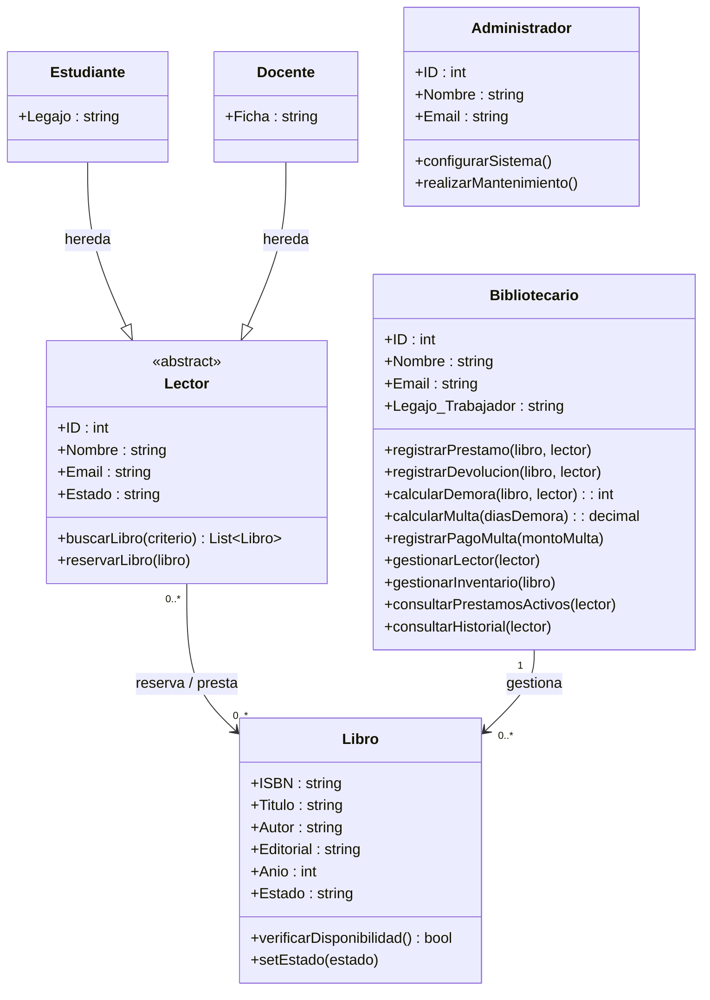

```mermaid
classDiagram
    class Lector {
        <<abstract>>
        +ID : int
        +Nombre : string
        +Email : string
        +Estado : string
        +buscarLibro(criterio) List~Libro~
        +reservarLibro(libro)
    }
    class Estudiante {
        +Legajo : string
    }
    class Docente {
        +Ficha : string
    }
    class Bibliotecario {
        +ID : int
        +Nombre : string
        +Email : string
        +Legajo_Trabajador : string
        +registrarPrestamo(libro, lector)
        +registrarDevolucion(libro, lector)
        +calcularDemora(libro, lector) : int
        +calcularMulta(diasDemora) : decimal
        +registrarPagoMulta(montoMulta)
        +gestionarLector(lector)
        +gestionarInventario(libro)
        +consultarPrestamosActivos(lector)
        +consultarHistorial(lector)
    }
    class Administrador {
        +ID : int
        +Nombre : string
        +Email : string
        +configurarSistema()
        +realizarMantenimiento()
    }
    class Libro {
        +ISBN : string
        +Titulo : string
        +Autor : string
        +Editorial : string
        +Anio : int
        +Estado : string
        +verificarDisponibilidad() bool
        +setEstado(estado)
    }

    
    Estudiante --|> Lector : hereda
    Docente --|> Lector : hereda
    Lector "0..*" --> "0..*" Libro : reserva / presta
    Bibliotecario "1" --> "0..*" Libro : gestiona
```
