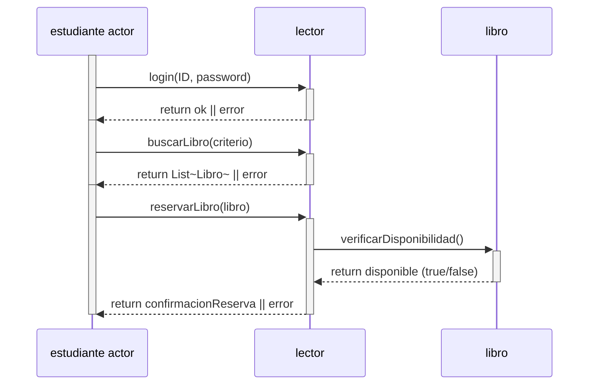

## 1. Reserva de un libro por parte de un estudiante




## 2. Devolución de un libro con cálculo de multa

```mermaid
sequenceDiagram
	participant A as bibliotecario actor
	participant B as bibliotecario
	participant C as libro

	A->>B: registrarDevolucion(libro, lector)

	B->>C: setEstado("Disponible")
	C-->>B: return OK
	B-->>A: return OK

	A->>B: calcularDemora(libro, lector)
	B-->>A: return diasDemora

	A->>B: calcularMulta(diasDemora)
	B-->>A: return montoMulta

	A->>B: registrarPagoMulta(montoMulta)
	B-->>A: return comprobantePago