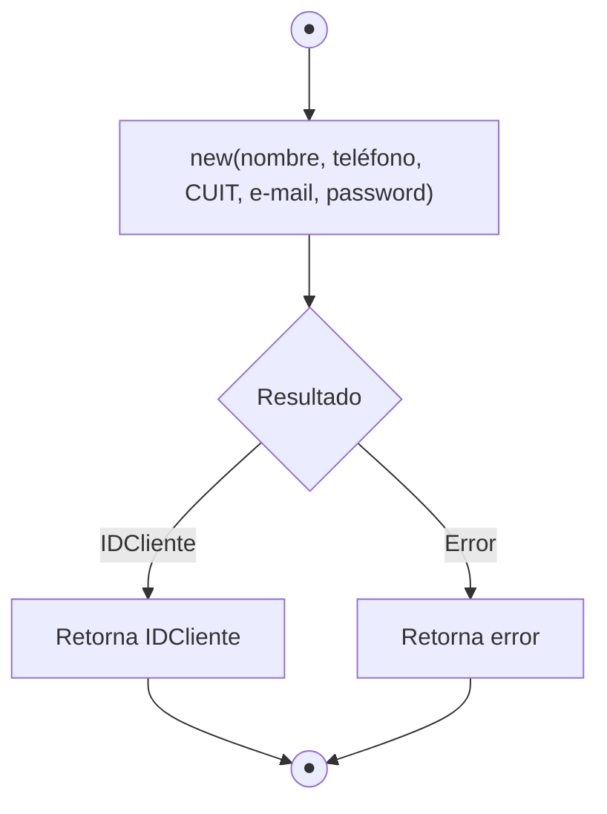

```mermaid
flowchart TD
    Start((●)) --> A["new(nombre, teléfono, CUIT, e-mail, password)"]
    A --> D{Resultado}
    D -->|IDCliente| B[Retorna IDCliente]
    D -->|Error| C[Retorna error]
    B --> End((●))
    C --> End
```
