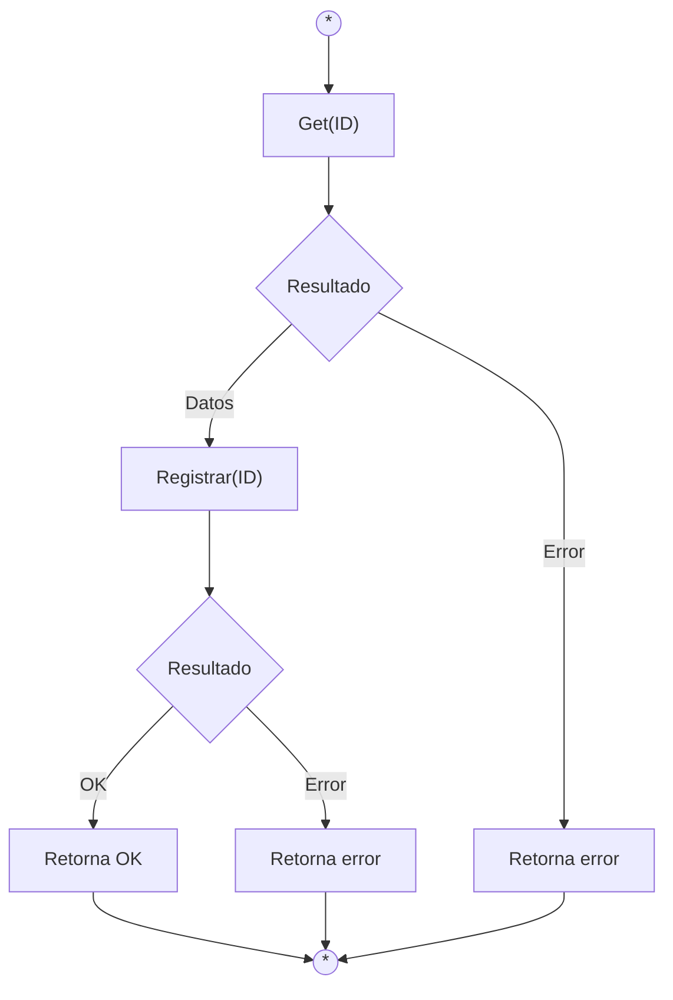

```mermaid
flowchart TD
    Start((*)) --> A["Get(ID)"]
    A --> D1{Resultado}
    D1 -->|Datos| B["Registrar(ID)"]
    D1 -->|Error| E1[Retorna error]
    B --> D2{Resultado}
    D2 -->|OK| C[Retorna OK]
    D2 -->|Error| E2[Retorna error]
    C --> End((*))
    E2 --> End
    E1 --> End
```
