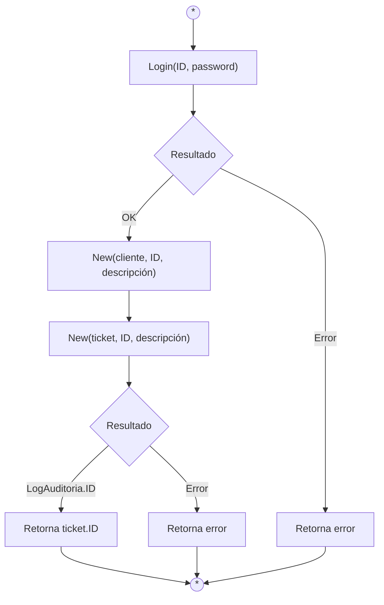

```mermaid
flowchart TD
    Start((*)) --> A["Login(ID, password)"]
    A --> D1{Resultado}
    D1 -->|OK| B["New(cliente, ID, descripción)"]
    D1 -->|Error| E1[Retorna error]
    B --> C["New(ticket, ID, descripción)"]
    C --> D2{Resultado}
    D2 -->|LogAuditoria.ID| F[Retorna ticket.ID]
    D2 -->|Error| E2[Retorna error]
    F --> End((*))
    E1 --> End
    E2 --> End
```
