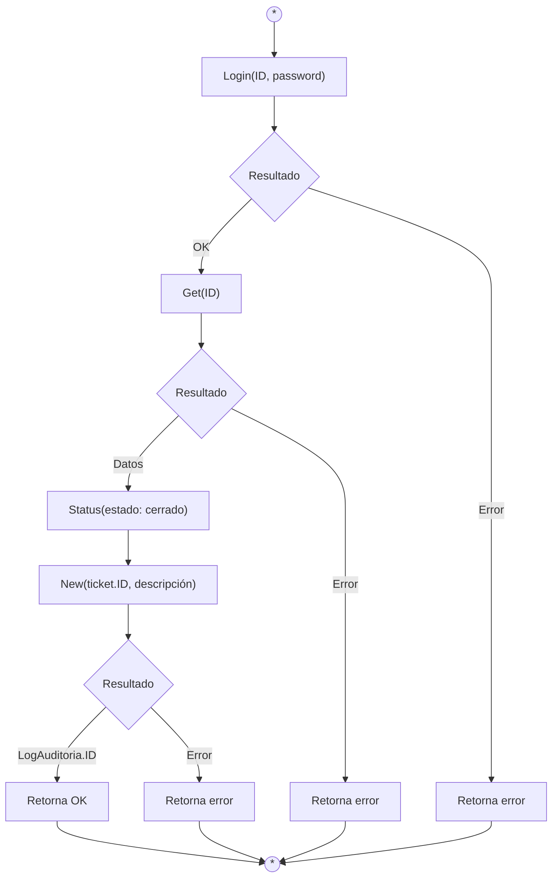

```mermaid
flowchart TD
    Start((*)) --> A["Login(ID, password)"]
    A --> D1{Resultado}
    D1 -->|OK| B["Get(ID)"]
    D1 -->|Error| E1[Retorna error]
    B --> D2{Resultado}
    D2 -->|Datos| C["Status(estado: cerrado)"]
    D2 -->|Error| E2[Retorna error]
    C --> F["New(ticket.ID, descripción)"]
    F --> D3{Resultado}
    D3 -->|LogAuditoria.ID| G[Retorna OK]
    D3 -->|Error| E3[Retorna error]
    G --> End((*))
    E1 --> End
    E2 --> End
    E3 --> End
```
