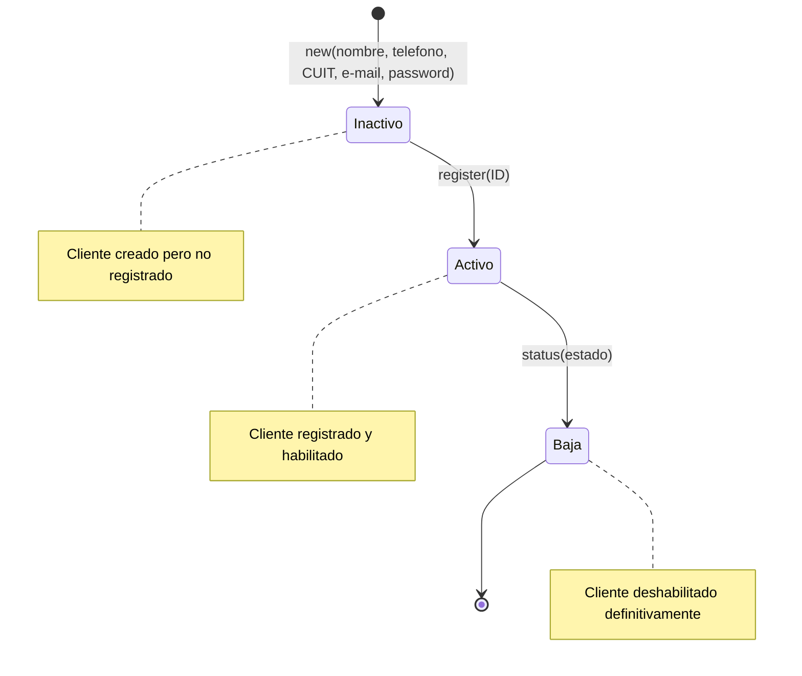

```mermaid
stateDiagram-v2
    [*] --> Inactivo : new(nombre, telefono, CUIT, e-mail, password)
    Inactivo --> Activo : register(ID)
    Activo --> Baja : status(estado)
    Baja --> [*]

    note right of Inactivo : Cliente creado pero no registrado
    note right of Activo : Cliente registrado y habilitado
    note right of Baja : Cliente deshabilitado definitivamente
```
