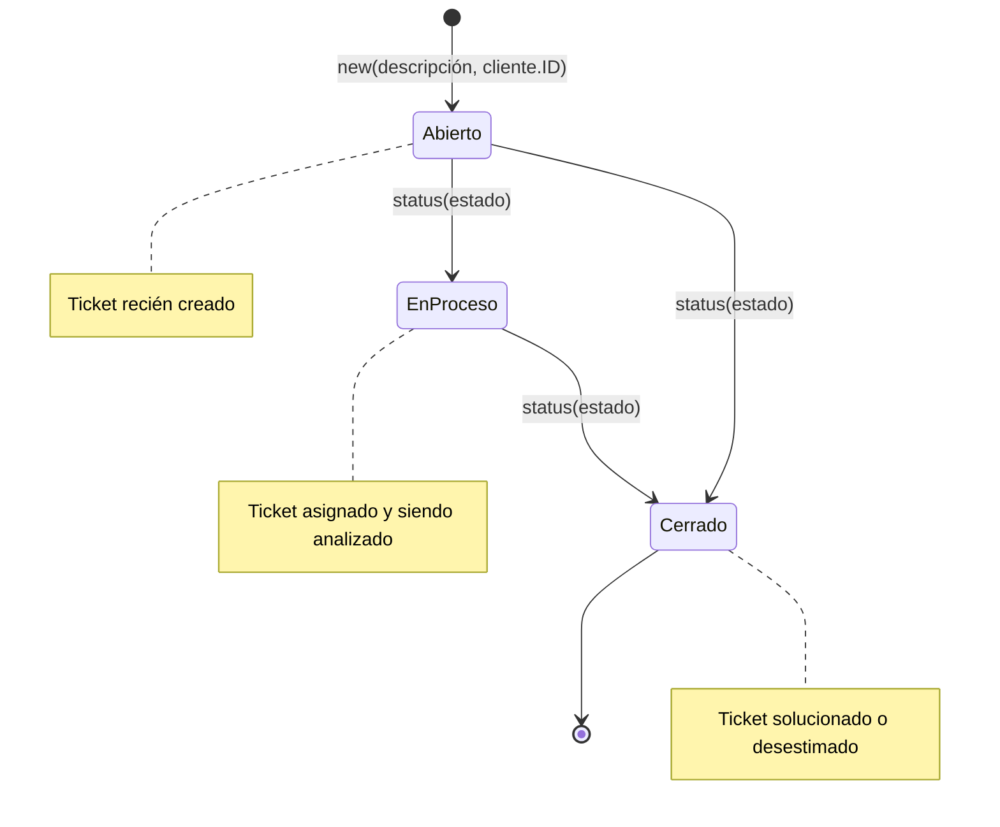

```mermaid
stateDiagram-v2
    [*] --> Abierto : new(descripción, cliente.ID)
    Abierto --> EnProceso : status(estado)
    EnProceso --> Cerrado : status(estado)
    Abierto --> Cerrado : status(estado)
    Cerrado --> [*]

    note right of Abierto : Ticket recién creado
    note right of EnProceso : Ticket asignado y siendo analizado
    note right of Cerrado : Ticket solucionado o desestimado
```
