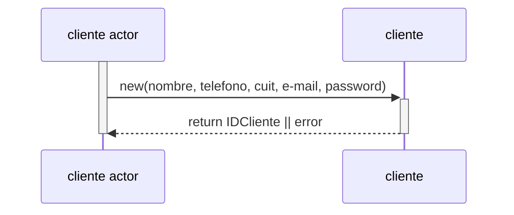

```mermaid
sequenceDiagram
    participant A as cliente actor
    participant B as cliente

	activate A
    A->>+B: new(nombre, telefono, cuit, e-mail, password)
    B-->>-A: return IDCliente || error
	deactivate A
```
