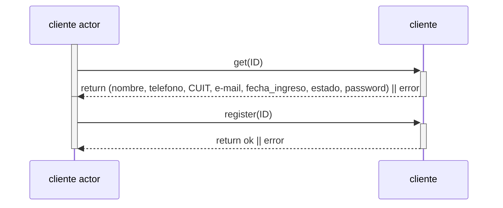

```mermaid
sequenceDiagram
    participant A as cliente actor
    participant B as cliente

	activate A
    A->>+B: get(ID)
    B-->>-A: return (nombre, telefono, CUIT, e-mail, fecha_ingreso, estado, password) || error
	deactivate A

	activate A
	A->>+B: register(ID)
	B-->>-A: return ok || error
	deactivate A
```
