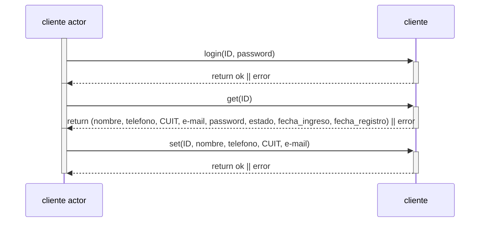

```mermaid
sequenceDiagram
	participant A as cliente actor
	participant B as cliente

	activate A
	A->>+B: login(ID, password)
	B-->>-A: return ok || error
	deactivate A

	activate A
	A->>+B: get(ID)
	B-->>-A: return (nombre, telefono, CUIT, e-mail, password, estado, fecha_ingreso, fecha_registro) || error
	deactivate A

	activate A
	A->>+B: set(ID, nombre, telefono, CUIT, e-mail)
	B-->>-A: return ok || error
	deactivate A
```
