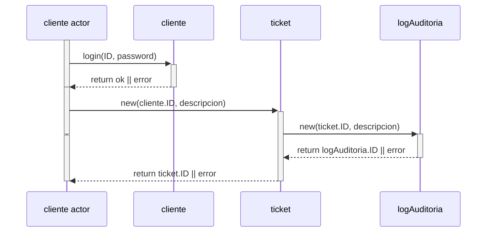

```mermaid
sequenceDiagram
	participant A as cliente actor
	participant B as cliente
	participant C as ticket
	participant D as logAuditoria

	activate A
	A->>+B: login(ID, password)
	B-->>-A: return ok || error
	deactivate A

	activate A
	A->>+C: new(cliente.ID, descripcion)
	C->>+D: new(ticket.ID, descripcion)
	deactivate A

	activate A
	D-->>-C: return logAuditoria.ID || error
	C-->>-A: return ticket.ID || error
	deactivate A
```
