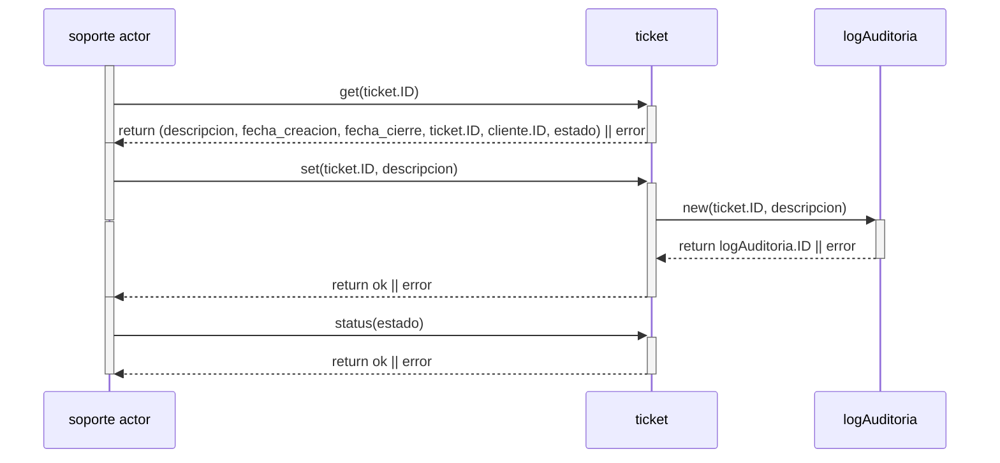

```mermaid
sequenceDiagram
	participant A as soporte actor
	participant B as ticket
	participant C as logAuditoria

	activate A
	A->>+B: get(ticket.ID)
	B-->>-A: return (descripcion, fecha_creacion, fecha_cierre, ticket.ID, cliente.ID, estado) || error
	deactivate A

	activate A
	A->>+B: set(ticket.ID, descripcion)
	B->>+C: new(ticket.ID, descripcion)
	deactivate A

	activate A
	C-->>-B: return logAuditoria.ID || error
	B-->>-A: return ok || error
	deactivate A

	activate A
	A->>+B: status(estado)
	B-->>-A: return ok || error
	deactivate A
```
