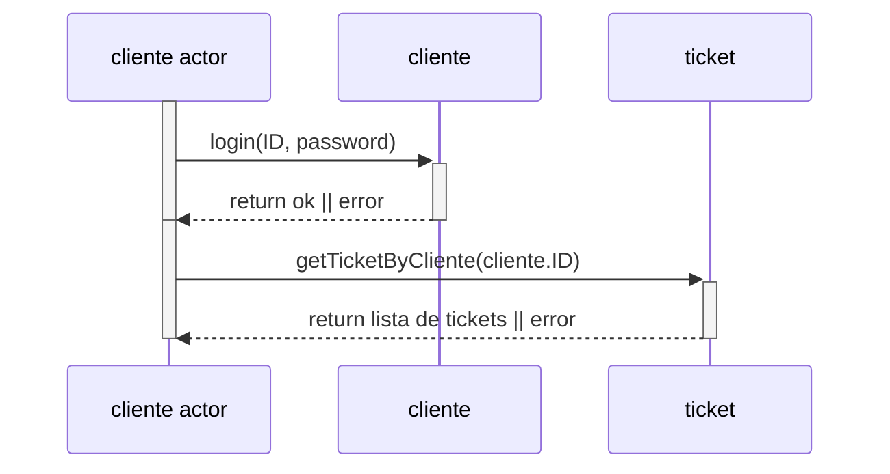

```mermaid
sequenceDiagram
	participant A as cliente actor
	participant B as cliente 
	participant C as ticket

	activate A
	A->>+B: login(ID, password)
	B-->>-A: return ok || error
	deactivate A

	activate A
	A->>+C: getTicketByCliente(cliente.ID)
	C-->>-A: return lista de tickets || error
	deactivate A
```
