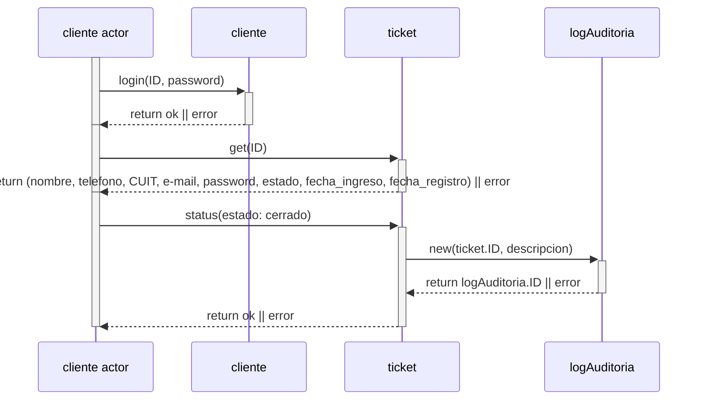

```mermaid
sequenceDiagram
	participant A as cliente actor
	participant B as cliente
	participant C as ticket
	participant D as logAuditoria

	activate A
	A->>+B: login(ID, password)
	B-->>-A: return ok || error
	deactivate A

	activate A
	A->>+C: get(ID)
	C-->>-A: return (nombre, telefono, CUIT, e-mail, password, estado, fecha_ingreso, fecha_registro) || error
	deactivate A

	activate A
    A->>+C: status(estado: cerrado)
    C->>+D: new(ticket.ID, descripcion)
    D-->>-C: return logAuditoria.ID || error
    C-->>-A: return ok || error
    deactivate A
	
```
