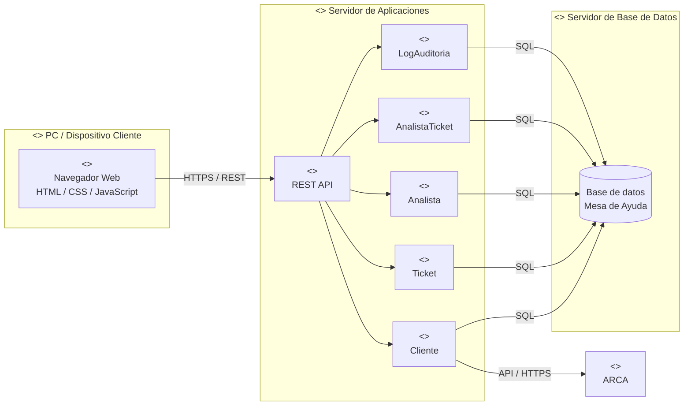

```mermaid
flowchart LR

    subgraph PC["<<dispositivo>> PC / Dispositivo Cliente"]
        Browser["<<entorno de ejecución>>\nNavegador Web\nHTML / CSS / JavaScript"]
    end

    subgraph APP["<<dispositivo>> Servidor de Aplicaciones"]
        API["<<componente>>\nREST API"]
        Cliente["<<componente>>\nCliente"]
        Ticket["<<componente>>\nTicket"]
        Analista["<<componente>>\nAnalista"]
        Asignacion["<<componente>>\nAnalistaTicket"]
        Auditoria["<<componente>>\nLogAuditoria"]
    end

    subgraph DB["<<dispositivo>> Servidor de Base de Datos"]
        Database[("Base de datos\nMesa de Ayuda")]
    end

    ARCA["<<sistema externo>>\nARCA"]

    Browser -->|"HTTPS / REST"| API

    API --> Cliente
    API --> Ticket
    API --> Analista
    API --> Asignacion
    API --> Auditoria

    Cliente -->|"SQL"| Database
    Ticket -->|"SQL"| Database
    Analista -->|"SQL"| Database
    Asignacion -->|"SQL"| Database
    Auditoria -->|"SQL"| Database

    Cliente -->|"API / HTTPS"| ARCA
```
